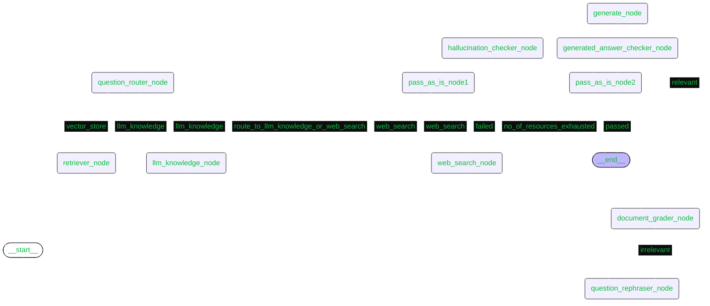

```mermaid
---
config:
  theme: base
  themeVariables:
    fontSize: '18px'
    primaryColor: '#0e0d0dff'
    primaryTextColor: '#0bbd3eff'
    primaryBorderColor: '#0a0a0aff'
    lineColor: '#ffffff'
    tertiaryColor: '#050505ff'
  flowchart:
    curve: linear
    defaultRenderer: "elk"
---
graph TD;
	__start__([<p>__start__</p>]):::first
	question_rephraser_node(question_rephraser_node)
	question_router_node(question_router_node)
	retriever_node(retriever_node)
	llm_knowledge_node(llm_knowledge_node)
	web_search_node(web_search_node)
	pass_as_is_node1(pass_as_is_node1)
	pass_as_is_node2(pass_as_is_node2)
	document_grader_node(document_grader_node)
	generate_node(generate_node)
	hallucination_checker_node(hallucination_checker_node)
	generated_answer_checker_node(generated_answer_checker_node)
	__end__([<p>__end__</p>]):::last
	__start__ --> question_rephraser_node;
	document_grader_node -. &nbsp;relevant&nbsp; .-> generate_node;
	document_grader_node -. &nbsp;route_to_llm_knowledge_or_web_search&nbsp; .-> pass_as_is_node1;
	document_grader_node -. &nbsp;irrelevant&nbsp; .-> question_rephraser_node;
	generate_node --> generated_answer_checker_node;
	generate_node --> hallucination_checker_node;
	generated_answer_checker_node --> pass_as_is_node2;
	hallucination_checker_node --> pass_as_is_node2;
	llm_knowledge_node --> document_grader_node;
	pass_as_is_node1 -. &nbsp;no_of_resources_exhausted&nbsp; .-> __end__;
	pass_as_is_node1 -. &nbsp;llm_knowledge&nbsp; .-> llm_knowledge_node;
	pass_as_is_node1 -. &nbsp;web_search&nbsp; .-> web_search_node;
	pass_as_is_node2 -. &nbsp;passed&nbsp; .-> __end__;
	pass_as_is_node2 -. &nbsp;failed&nbsp; .-> web_search_node;
	question_rephraser_node --> question_router_node;
	question_router_node -. &nbsp;llm_knowledge&nbsp; .-> llm_knowledge_node;
	question_router_node -. &nbsp;vector_store&nbsp; .-> retriever_node;
	question_router_node -. &nbsp;web_search&nbsp; .-> web_search_node;
	retriever_node --> document_grader_node;
	web_search_node --> document_grader_node;
	classDef default fill:#f2f0ff,line-height:1.2
	classDef first fill-opacity:0
	classDef last fill:#bfb6fc
```
