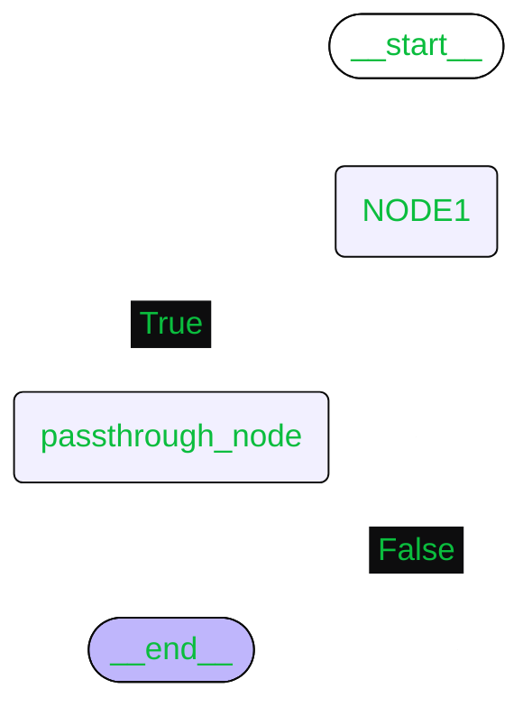

```mermaid
---
config:
  theme: base
  themeVariables:
    fontSize: '18px'
    primaryColor: '#0e0d0dff'
    primaryTextColor: '#0bbd3eff'
    primaryBorderColor: '#0a0a0aff'
    lineColor: '#ffffff'
    tertiaryColor: '#050505ff'
  flowchart:
    curve: linear
---

graph TD;
	__start__([<p>__start__</p>]):::first
	NODE1(NODE1)
	passthrough_node(passthrough_node)
	__end__([<p>__end__</p>]):::last
	NODE1 -. &nbsp;True&nbsp; .-> passthrough_node;
	__start__ --> NODE1;
	passthrough_node --> __end__;
	NODE1 -. &nbsp;False&nbsp; .-> NODE1;
	classDef default fill:#f2f0ff,line-height:1.2
	classDef first fill-opacity:0
	classDef last fill:#bfb6fc

```
